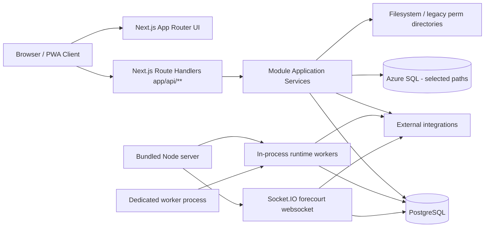
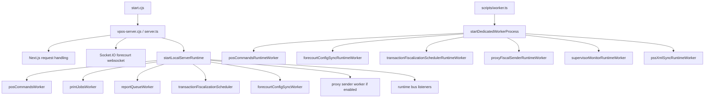
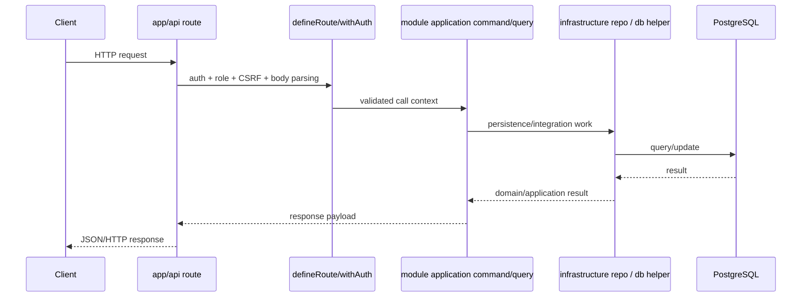
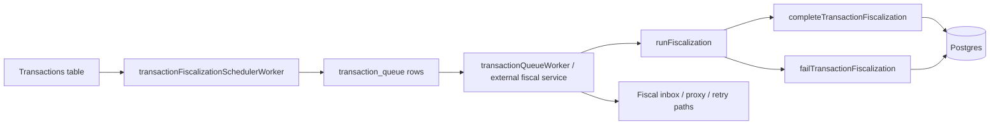
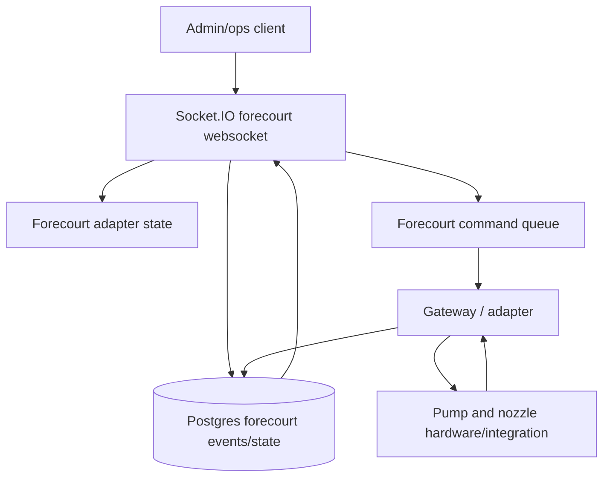

# Architecture

## Purpose

This document describes the current architecture of the VPOS FTC app as implemented in this repository.

The codebase is in a **hybrid state**:

- parts of the system already follow a clearer module/application/infrastructure split
- some runtime and integration flows still preserve legacy behavior for compatibility
- several files explicitly note that migration/extraction is ongoing

That means the architecture is best understood as **a modular monolith with embedded worker runtimes and external integration adapters**.

## High-level view



## Architectural style

### 1) Modular monolith

The main app is shipped as one deployable codebase and usually one primary web-server process, but internally it is organized into domain-oriented modules under `src/modules/`.

Examples:

- `transactions`
- `forecourt`
- `products`
- `customers`
- `setup`
- `reports`
- `printing`
- `runtime`
- `supervisor`

This keeps deployment simple while still giving the code a strong domain boundary structure.

### 2) Platform vs module split

A useful mental model is:

- **`src/platform/`** = infrastructure/platform concerns the whole app depends on
- **`src/modules/`** = business capabilities
- **`src/shared/`** = cross-cutting facades, helpers, utility layers, and compatibility surfaces

#### Platform layer responsibilities

`src/platform/` owns concerns such as:

- DB connectivity and query helpers
- runtime composition roots
- bootstrap and first-boot behavior
- configuration loading and defaults
- auth/session implementation
- observability/metrics/health
- generic web-route helpers
- security/rate limiting

#### Module layer responsibilities

`src/modules/` owns use-case logic such as:

- fiscalizing a queued transaction
- listing products
- syncing forecourt configuration
- creating customers
- generating reports
- handling setup workflows

### 3) Embedded worker architecture

This is not only a request/response web app.

The system also contains long-lived background loops for:

- POS command polling
- forecourt config synchronization
- transaction queue scheduling
- print jobs
- report jobs
- proxy fiscal sending
- supervisor/heartbeat monitoring
- optional PSS XML watch/sync behavior

These workers can run:

- in the main server process
- in a dedicated omnibus worker process
- as standalone worker entrypoints

## Code organization

### Top-level layout

```text
app/                  UI routes + HTTP API endpoints
src/modules/          Domain/business modules
src/platform/         Platform/runtime/infrastructure
src/shared/           Cross-cutting facades and compatibility helpers
server/               websocket + legacy server support
workers/              thin worker entrypoints
scripts/              operational scripts, migrations, diagnostics
```

### Internal module shape

Many modules use a layered folder structure like:

```text
application/
domain/
infrastructure/
presentation/
```

That typically maps to:

- **application** — use cases, commands, queries, orchestration
- **domain** — domain models/rules when explicitly modeled
- **infrastructure** — DB repos, adapters, worker implementations, storage
- **presentation** — presenters/view-models for API or UI consumption

Not every module has every layer yet.

## Runtime topology



## Entrypoints

### Web server

Primary files:

- `start.cjs`
- `server.ts`
- `server/forecourtWs.ts`

Behavior:

1. load env files
2. install process diagnostics
3. acquire process guard / lock for DOMS process coordination
4. run bootstrap and migrations
5. import legacy data if present
6. load forecourt runtime config
7. start selected runtime workers
8. prepare the Next.js app
9. bind HTTP/HTTPS server
10. attach websocket support

### Dedicated worker process

Primary file:

- `scripts/worker.ts`

Composition is defined in:

- `src/platform/runtime/composition-root.ts`

This process is intended for long-lived polling work that should not depend on request traffic.

### Standalone workers

Primary files:

- `workers/fiscalize-transaction.worker.ts`
- `workers/receipt-print.worker.ts`
- `workers/proxy-sender.worker.ts`

These are thin wrappers over platform runtime services.

## Request architecture

HTTP requests are primarily implemented through Next route handlers in `app/api/**`.

A common request path is:



Representative examples in the repo:

- `app/api/transactions/[id]/fiscalize/route.ts`
- `app/api/products/route.ts`
- `app/api/control/registry/route.ts`

## Transaction and fiscalization pipeline

The transaction path is one of the most important flows in the system.

### Observed pipeline

1. transactions are created and stored in Postgres
2. eligible transactions are claimed by the **transaction fiscalization scheduler**
3. queue rows are inserted for downstream fiscalization work
4. fiscalization execution is handled by dedicated queue/worker logic or an external service path
5. completion/failure updates transaction status and related records
6. proxy sending and fiscal inbox flows provide additional delivery/retry handling

### Important nuance

The server-side in-process runtime explicitly states that **actual fiscalization execution is not fully handled in-process** in the default local runtime, because an external service may read from Postgres. The scheduler still runs locally to claim/enqueue eligible work.

### Transaction flow diagram



## Forecourt architecture

Forecourt support spans several layers:

- configuration sync worker
- adapter state management
- websocket transport to clients
- pump/tank status queries and commands
- persistence of forecourt events/state in Postgres

### Key pieces

- `src/modules/forecourt/**`
- `server/forecourtWs.ts`
- shared forecourt adapters/runtime state under `src/shared/forecourt/**`

### Behavior

The websocket server:

- attaches to the Node HTTP server
- tracks connected clients
- reads local adapter state and persisted shared state
- computes a derived forecourt status (`online`, `degraded`, `offline`)
- validates commands and nozzle context
- publishes state/ack messages back to clients

### Forecourt flow diagram



## Runtime bus

The app includes an in-process pub/sub bus in `src/shared/runtime/bus.ts`.

This bus is used for decoupled internal events, including:

- POS events
- fiscal request/response coordination
- archive capture
- pending attendant auth tracking

The archive bus listener also stores best-effort records of runtime events.

This gives the monolith an internal event-driven spine without requiring an external broker.

## Persistence architecture

### PostgreSQL: primary datastore

Postgres is the main system of record.

Migration names indicate it stores:

- core entities and stations
- transactions and fiscalization events
- receipts and credit notes
- products and categories
- customers
- pump/tank/nozzle and forecourt state
- sync jobs and queues
- process heartbeats
- station KV/config/version history
- logs, archive exports, and secure artifacts
- fiscal inbox and retry/dead-letter support

### Azure SQL: secondary/integration datastore

The repo also includes `src/platform/db/azure-sql.ts` and Azure SQL migrations.

This appears to be a secondary or compatibility datastore rather than the primary runtime data backbone.

### Filesystem-backed legacy inputs

The system still interacts with filesystem directories for:

- legacy imports
- permanent/station data directories
- PSS XML integration
- local certificates

This is an important compatibility concern in deployments that still ingest legacy outputs.

## Bootstrap and configuration architecture

Bootstrap begins in platform runtime/server startup and includes:

- Postgres migrations
- advisory locking to prevent duplicate first-boot execution
- station creation or reconciliation
- station settings seeding
- legacy import if available
- station config bootstrap
- bootstrap completion markers in station KV

Configuration can originate from:

- env vars
- station KV
- DB-stored `station_config`
- imported JSON config
- platform defaults

The config loader merges/minimizes these sources and validates them against schema.

## Authentication and security

### Authentication model

- session-cookie based auth
- login route issues server-side sessions
- session cookie name: `tin_capture_session`
- role-aware route guards around most API handlers

### CSRF model

Mutation helpers validate CSRF by default using headers and/or body tokens.

### Authorization model

Role checks are centralized through shared auth/platform policy helpers. Observed roles include:

- tenant
- manager
- administrator

### Other security-related concerns

The repo also contains:

- rate-limit helpers
- secure-artifact support
- password hashing and session cleanup logic
- request/body validation wrappers

## Reliability mechanisms

The architecture includes several resilience features:

### 1) Process guard

`server.ts` uses a DOMS process guard to avoid problematic duplicate process startup behavior in some deployment modes.

### 2) Advisory locks

First-boot initialization uses Postgres advisory locks to serialize bootstrap work.

### 3) Worker heartbeats

Workers upsert heartbeat records, allowing stale-worker detection and restart logic.

### 4) In-process monitoring

`startInProcessRuntime` monitors worker heartbeat freshness and can restart stale workers with exponential backoff.

### 5) Production diagnostics wrapper

`start.cjs` adds diagnostics for:

- uncaught exceptions
- unhandled rejections
- process lifecycle events
- optional heartbeat file emission
- optional redacted env dumps

### 6) Health and readiness endpoints

- `/api/healthz`
- `/api/readyz`
- `/api/metrics`

## Deployment shape

### Build

```text
next build
+ esbuild bundle of server.ts -> vpos-server.cjs
```

### Runtime

- Next standalone output is enabled in `next.config.mjs`
- `start.cjs` is the production-friendly wrapper
- the server can run in HTTP or HTTPS mode
- websocket support is attached in the same process

### Operational implication

This is best deployed as a **small set of cooperating Node processes**:

- 1 web process
- optionally 1 omnibus worker process
- optionally additional dedicated workers for queue isolation

## Key architectural strengths

- strong domain/module decomposition for a single-repo system
- centralized route/auth/error-handling helpers
- practical runtime supervision and heartbeat support
- explicit first-boot and migration flow
- flexible worker deployment model
- clear separation between platform concerns and business modules

## Current architectural trade-offs

### 1) Hybrid legacy/canonical structure

Some files are clearly marked as compatibility or migration-era paths. This is workable, but it increases the cognitive load for maintainers.

### 2) Runtime divergence

The local server runtime, omnibus worker runtime, and standalone worker entrypoints do not all start exactly the same set of services. That is intentional today, but must stay documented or operators will make incorrect assumptions.

### 3) Mixed persistence story

The system is operationally Postgres-first, but still carries Azure SQL and filesystem compatibility paths. That adds flexibility at the cost of complexity.

### 4) Large route surface

The API surface is broad and operationally rich. That is useful for the product, but it raises the importance of consistent route conventions, integration testing, and endpoint ownership.

## Extension guidance

When adding new functionality, follow this pattern where possible:

1. create or extend a business module under `src/modules/<capability>`
2. put use-case logic in `application/`
3. isolate persistence/adapters in `infrastructure/`
4. expose HTTP behavior through `app/api/**`
5. use platform route helpers for auth/CSRF/error handling
6. prefer platform/shared facades instead of reaching directly across unrelated modules
7. add heartbeat/observability if the feature introduces background processing

## Suggested future cleanup

To make the architecture easier to operate and document, the next improvements would be:

- standardize which runtime responsibilities belong to web vs omnibus vs standalone workers
- add explicit runbooks for each runtime mode
- publish an `.env.example`
- publish a DB schema map for the top 20 tables
- add a formal test runner and CI command
- continue collapsing legacy compatibility paths behind platform/module facades
