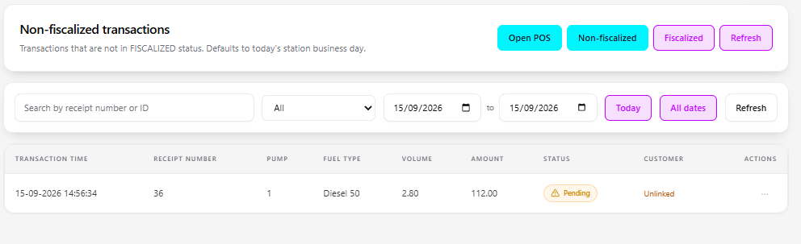

# Documentation Screenshot Assets

This directory is reserved for approved screenshots used by production support and manager training documentation.

## Folder convention

When screenshots are captured, store them under:

```text
docs/images/support/
docs/images/managers/
```

The Markdown guides currently contain visible **Screenshot placeholder** callouts with the intended filename and capture requirements. Replace each placeholder with the approved image once available.

## Capture rules

Before committing any screenshot:

- use a training, test, or approved demonstration station where possible
- do not expose passwords, access tokens, session cookies, private keys, database connection strings, fiscal credentials, or certificate material
- redact customer names, TIN/tax identifiers, vehicle/loyalty identifiers, phone numbers, email addresses, and other personal data unless the screenshot uses approved synthetic data
- redact production IP addresses, hostnames, station identifiers, proxy endpoints, and other infrastructure details when they are not required to explain the workflow
- keep the relevant page title, status, timestamp/context, pump/tank/transaction labels, and action controls visible
- capture the full workflow context rather than a tightly cropped button with no navigation or state
- use consistent browser zoom and viewport size across a guide
- do not annotate screenshots with credentials or operational secrets

## Recommended filenames

### Support

- `support-startup-status.png`
- `support-readiness-health.png`
- `support-forecourt-monitor.png`
- `support-diagnostics.png`
- `support-print-jobs.png`
- `support-setup-jpl.png`
- `support-reconciliation.png`

### Managers

- `manager-dashboard-start-shift.png`
- `manager-transactions-search.png`
- `manager-non-fiscalized.png`
- `manager-receipt-lookup.png`
- `manager-pumps.png`
- `manager-tank-levels.png`
- `manager-forecourt-pricing.png`

## Replacing a placeholder

Replace the callout with normal Markdown, for example:

```markdown

```

Adjust the relative path to match the guide location. Keep the descriptive caption text immediately below the screenshot when it adds operational context.
